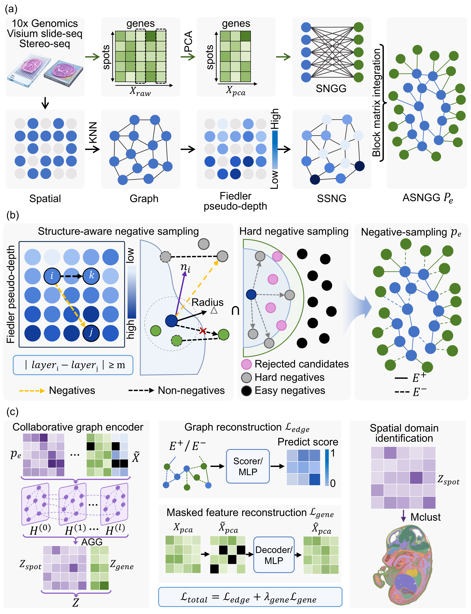

# SAGA-ST

SAGA-ST is the code repository for the accompanying paper. It provides the model implementation and reproduction commands for spatial transcriptomics representation learning and spatial domain clustering. Raw datasets and generated outputs are not stored in Git.

## Overview

SAGA-ST learns spot-level representations from gene expression and spatial neighborhood graphs. The workflow first builds a spatial graph, trains a graph representation model with augmentation and reconstruction objectives, then clusters the learned embeddings for downstream spatial domain analysis.



## Installation

```bash
conda env create -f environment.yml
conda activate sp

pip install torch-scatter torch-sparse torch-cluster torch-spline-conv \
  -f https://data.pyg.org/whl/torch-2.5.0+cu121.html
pip install torch-geometric
```

## Dataset Downloads

Download datasets from the original public sources:

- DLPFC: https://research.libd.org/spatialLIBD/
- Mouse Brain Serial Sections: https://www.10xgenomics.com/resources/datasets
- Coronal Mouse Brain: https://www.10xgenomics.com/resources/datasets
- Human Breast Cancer: https://support.10xgenomics.com/spatial-gene-expression/datasets/1.1.0/V1_Breast_Cancer_Block_A_Section_1
- Mouse Embryo MOSTA: https://db.cngb.org/stomics/mosta/download/

More detailed dataset links are listed in `dataset/README.md`.

## Usage and Reproduction

Download DLPFC sample `151673` from spatialLIBD and place it at `dataset/DLPFC/151673.h5ad`.

Set deterministic runtime variables:

```bash
unset OMP_NUM_THREADS
export OMP_NUM_THREADS=2
export MKL_NUM_THREADS=2
export OPENBLAS_NUM_THREADS=2
export NUMEXPR_NUM_THREADS=2
export NUMBA_THREADING_LAYER=workqueue
export CUBLAS_WORKSPACE_CONFIG=:4096:8
export CUDA_VISIBLE_DEVICES=0
```

Train SAGA-ST embeddings:

```bash
python -m model.main \
  --h5 "dataset/DLPFC/151673.h5ad" \
  --out_prefix "outputs/DLPFC/151673/151673_base" \
  --k 15 \
  --use_scanpy_workflow --pca_comps 64 \
  --hidden 512 \
  --lambda_recon 0.05 --mask_ratio_feat 0.2 \
  --epochs 1200 \
  --layer_aware --no_layer_fallback \
  --pseudo_layer_bins 7 --pseudo_layer_knn 20 \
  --layer_gamma 4.0 \
  --neg_hard_ratio 0.6 --neg_oversample 8 \
  --normal_aware \
  --normal_knn 15 \
  --activation prelu --scheduler \
  --lr 5e-4 --weight_decay 1e-4 \
  --seed 42
```

Cluster and evaluate:

```bash
python -m model.cluster \
  --npz "outputs/DLPFC/151673/151673_base.augK2_d64_for_cluster.npz" \
  --h5 "dataset/DLPFC/151673.h5ad" \
  --label_key "sce.layer_guess" \
  --method mclust \
  --use_rep emb \
  --pca_dim 50 \
  --n_clusters 7 \
  --smooth \
  --smooth_k 6 \
  --refine \
  --refine_iter 2 \
  --merge_small \
  --min_cluster_size 30 \
  --calc_acc \
  --out_prefix "outputs/DLPFC/151673/151673_base_merge30"
```
